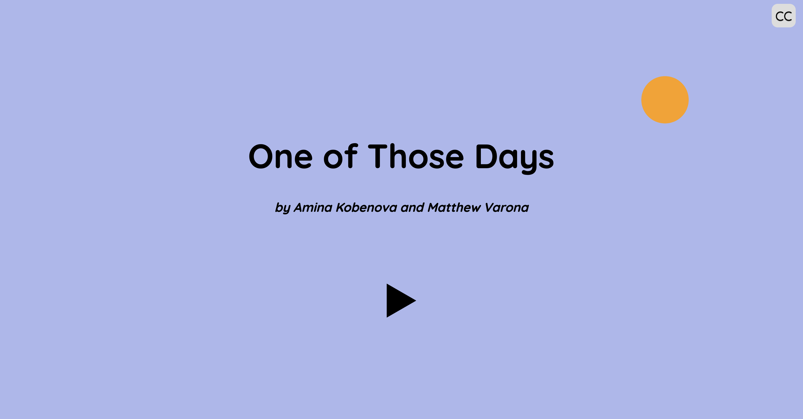
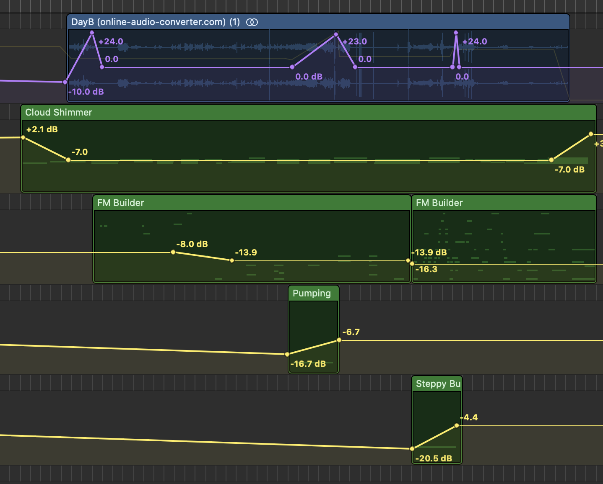

# One of Those Days

[mjvar.github.io/one-of-those-days](mjvar.github.io/one-of-those-days)

## Documentation

### Concept

One of Those Days is an aural exploration of mental health. The piece walks through two days in an unnamed character's life, similar in structure but with differing degrees of mental health. Using sound effects, music, and changing events, One of Those Days draws contrast between two discrete states of mental well-being in the hopes of immersing the listener into two different atmospheres.

### Process

Amina and I both recorded the majority of the sounds on our own, which was fun. By experimenting with different mic distances, I was able to achieve a variety of effects. I actually directly brushed the mic grill of my phone to get a more crisp tooth brushing effect, then rolled off the higher frequencies in Logic.

On my end of the project, I worked on music, web dev, and some mastering. The web development aspect of this project was simple but time consuming. I did learn a few new Javascript tricks along the way (in particular, integrating p5.js with vanilla Javascript and with the DOM model, which will be very useful for future creative endeavors). Amina had the great idea of adding closed captions for hearing impaired people, so I learned about HTML injections using JS.

I wrote a bunch of music for the piece in 2 days, which is probably the fastest I've ever written any musical thing without hating the end product. I'm not quite sure if that's because I learned to work quicker or my standards lowered because of the looming deadline, but I think the music at least supports the different themes in each day, so I'm satisfied.

I was able to learn quite a bit about Audacity and Logic. I mainly found that Audacity is not a very good program. The UI is kind of just painful and the whole program is laggy (but at least it's open source! So I'm sure it has benefited many people as well). 

Logic has powerful automation, synth, and EQ features, so I took advantage of those particularly for Day B. I played around with synth presets to get some pretty strange and atmospheric sound effects. I used automation to create volume and EQ ramps in certain parts of the track, to emphasize feelings of anxiety. I also rolled off a lot of the higher frequencies to reduce harshness for some of the more tinny sounds.

Conceptually, it was quite difficult to figure out how to draw contrast between "good" and "bad" mental health days. Since the project was being done on a tight schedule, we kind of had to just go ahead and record sounds, and then hope they would work together. Of course, we planned each sound we recorded, but that's still not quite the same as hearing the whole thing come together and then re-recording bits that might not work (which we didn't have time for). We realized, perhaps a bit too late, that the contrast between the two days wasn't incredibly clear. Throwing in weird sound effects in Day B was a good stopgap for this, though. The visuals also lessen the effort that listeners need to exert to understand the piece. I guess the [we'll fix it in post](https://www.urbandictionary.com/define.php?term=Fix%20It%20In%20Post) trope holds true even outside the film world.

### Reflection

This project, along with my last one (the web comic about death), makes me feel like I have a tendency to bite off more than I can chew conceptually. When working on more delicate or complex topics, there's a more pressing need to get things right to make sure the final product doesn't seem vapid or contrived. I'm not entirely sure this project has achieved that, although I am proud of our group for finishing it. Of course, this isn't to say that I should just make cutesy things forever and avoid meaningful topics. But maybe for class projects with limited timeframes and grading rubrics and such, it could be helpful to have more measured expectations.

On a less heavy note, this project reinforced my belief that simple, minimalist designs are both easier to make and easier to get right. I probably can't go the minimalist route for every website I create, but at least in the design sense I'm getting better at estimating what I can pull off properly. Overall, I'm still happy with how this project turned out. I picked up a bunch of useful skills along the way, and I learned valuable lessons about goal-setting and scope.